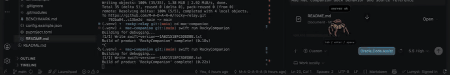

# Rocky Relay

## Demo

[](mac-companion/demo/rocky_mac_twitter.mp4)

Click the preview to watch the full demo:
[rocky_mac_twitter.mp4](mac-companion/demo/rocky_mac_twitter.mp4)

Low-latency personal voice assistant experiment inspired by Rocky from
Project Hail Mary.

The goal is to build a small STT -> LLM -> TTS assistant that can eventually
run from a Raspberry Pi 4 device, while using a faster Mac or LAN server for
heavier work when needed.

Phase 1 is Mac-first benchmarking. Before touching the Pi deployment path, this
project should prove the latency, quality, and architecture locally.

Project narrative and decision history:

- [Project Journey](docs/project-journey.md)
- [Benchmarks](BENCHMARK.md)
- [Security Notes](docs/security.md)
- [Mac Companion](mac-companion/README.md)

## Why This Name

`rocky-relay` captures the intended split:

- Rocky-style voice and phrasing.
- A lightweight device client that relays audio/events.
- A local server that handles expensive speech and language work.

## References

- Rocky voice clone write-up:
  https://pedsidian.pedramamini.com/Claude/Blog/2026-03-28-rocky-voice-clone
- Rocky voice clone gist:
  https://gist.github.com/pedramamini/fa5f6ef99dae79add220188419230642
- Coyote Interactive:
  https://github.com/gregm123456/coyote_interactive
- Agent Rocky Mac companion reference:
  https://github.com/itmesneha/agentrocky
- Local tested Rocky clone assets:
  `../rocky-pi/rocky/`

## Product Goal

Build a personal low-latency voice assistant with:

- Push-to-talk interaction first.
- Fast speech-to-text.
- Local LLM replies where practical.
- Swappable text-to-speech backends.
- Optional Rocky-style speech transform.
- Optional Rocky cloned voice generation.
- Pi 4 as the eventual physical interface.

The first milestone is not a perfect clone. The first milestone is an honest
latency benchmark and a usable loop.

## Architecture

The project should start with two runnable components, even on the Mac:

```text
client/
  Captures microphone audio.
  Sends audio to the server.
  Plays returned speech.
  Later maps cleanly to the Raspberry Pi 4.

server/
  Receives audio.
  Runs STT.
  Calls the LLM.
  Applies persona / Rocky text shaping.
  Runs TTS.
  Returns WAV/audio to the client.
```

Initial local flow:

```text
push-to-talk
  -> capture microphone audio
  -> send audio to local server
  -> transcribe with STT
  -> generate reply with LLM
  -> optionally transform into Rocky-speak
  -> synthesize speech
  -> return audio
  -> play response
```

Current audio-file flow:

```text
audio WAV
  -> STT backend
  -> existing LLM/persona/TTS pipeline
  -> response WAV
  -> latency log
```

## Proposed Stack

Mac benchmark stack:

- STT: `whisper.cpp` or `whisper-stream`
- LLM: Ollama-served local model
- Low-latency TTS baseline: Piper
- Rocky cloned TTS: local `rocky_say` integration
- Interaction mode: push-to-talk
- Transport: local HTTP/WebSocket between client and server

Future Pi stack:

- Pi 4: microphone, button, speaker, LEDs, simple client loop
- LAN server: STT, LLM, cloned TTS, benchmarking logs
- Optional Pi-local TTS only if latency and quality are acceptable

## TTS Backends

TTS should be swappable from day one:

```text
piper
  Fast baseline.
  Best for measuring what "good latency" feels like.

rocky_xtts
  Fastest cloned-voice path.
  Talks directly to the already-running Rocky XTTS HTTP server.

rocky_xtts_cli
  Compatibility path.
  Calls rocky_say as a subprocess and can apply speed adjustment.
  Slower because it adds process, temp file, and ffmpeg overhead.

rocky_yourtts
  Uses rocky_say + YourTTS.
  Worth benchmarking because the Rocky script describes it as fast and high quality.
```

The persona layer should stay separate from the voice engine:

```text
LLM reply
  -> optional Rocky text transform
  -> selected TTS backend
```

This lets us compare:

- Plain assistant text with Piper.
- Rocky-styled text with Piper.
- Plain assistant text with Rocky cloned TTS.
- Rocky-styled text with Rocky cloned TTS.

## Latency Metrics

Every turn should log:

- Capture duration.
- Upload / request overhead.
- STT latency.
- LLM first-token latency.
- LLM full-response latency.
- Persona transform latency.
- TTS generation latency.
- Trigger-to-audio-ready latency.
- Playback start latency.
- Total trigger-to-first-audio latency.
- Total trigger-to-finished-playback latency.

The key user-experience number is:

```text
button press -> first audible response
```

The current file-based benchmark measures:

```text
benchmark trigger -> response WAV ready to play
```

This is logged as `trigger_to_audio_ready_ms`. Playback startup and
trigger-to-first-audible-audio come next.

## Benchmark Scenarios

Run each scenario cold and warm:

- Typed text -> LLM -> TTS.
- 1-second spoken prompt -> STT -> LLM -> TTS.
- 3-second spoken prompt -> STT -> LLM -> TTS.
- 6-second spoken prompt -> STT -> LLM -> TTS.
- Piper backend.
- Rocky XTTS backend.
- Rocky YourTTS backend.
- With and without Rocky text transform.

## Phases

### Phase 0: Project Skeleton

- Create `client` and `server` directories.
- Add shared latency logging.
- Add typed-input smoke test.
- Add backend configuration.

### Phase 1: Mac Benchmark

- Implement push-to-talk client on Mac.
- Implement local server.
- Integrate STT.
- Integrate Ollama.
- Integrate Piper.
- Integrate local Rocky TTS script.
- Produce benchmark logs.

### Phase 2: Pi Client Prototype

- Move only the client loop to Raspberry Pi 4.
- Keep server on Mac/LAN machine.
- Test USB mic, physical button, and speaker.
- Add LEDs or simple hardware state indicators.

### Phase 3: Latency Decisions

Use measured data to decide:

- What can run safely on the Pi.
- What must stay on the LAN server.
- Whether Piper is enough for fast mode.
- Whether Rocky cloned TTS is acceptable for normal use.
- Whether true voice-clone R&D is worth deeper investment.

## Non-Goals For V1

- No wake word in the first pass.
- No always-listening mode in the first pass.
- No Pi deployment before Mac latency is measured.
- No commercial use.
- No claim of official Project Hail Mary affiliation.

## Local Rocky Assets

The Rocky gist is vendored inside this project for direct text-transform use:

```text
vendor/rocky-say/rocky_say
```

The existing tested Rocky clone assets still live beside this project:

```text
../rocky-pi/rocky/rocky_say
../rocky-pi/rocky/rocky_training_audio_scrubbed.wav
../rocky-pi/rocky/rocky_voice.pth
```

Useful local checks:

```bash
python3 vendor/rocky-say/rocky_say --transform-only "Hello, how are you doing today?"
python3 vendor/rocky-say/rocky_say --server status
python3 vendor/rocky-say/rocky_say --server start --agree-cpml
```

## Git Initialization

From this folder:

```bash
git init
git add README.md
git commit -m "Initial Rocky Relay project brief"
```

## Current Scaffold

This repo now has a Python-only scaffold with no required runtime dependencies
for the app shell:

```text
src/rocky_relay/client/
  typed.py        Typed client that calls the local server and writes WAV output.
  audio.py        Audio client that sends WAV input to the local server.

src/rocky_relay/server/
  app.py          Minimal HTTP server with /chat and /audio endpoints.

src/rocky_relay/backends/
  llm.py          Echo and Ollama LLM backends.
  tts.py          Silent, tone, macOS say, and Piper TTS backends.

src/rocky_relay/benchmarks/
  tts.py          TTS/typed-turn benchmark CLI.
  stt.py          STT/audio-file benchmark CLI.
  live.py         One-recording Mac mic benchmark CLI.
  doc.py          BENCHMARK.md table append helper.

src/rocky_relay/
  pipeline.py     Typed turn pipeline and JSONL latency logging.
  mac_ptt.py      macOS global hold-to-talk client.
  persona.py      none, rocky_basic, and rocky_say persona transforms.
  config.py       JSON config loader.

mac-companion/
  RockyCompanion.xcodeproj
                 Swift macOS floating companion app for demos.
```

The scaffold is deliberately small so the future Pi client can stay reliable.
Heavy tools such as Ollama, Whisper, Piper models, and Rocky cloned TTS should
stay on the Mac/LAN server until benchmarks prove otherwise.

## Quick Start

If this repo is freshly cloned elsewhere, fetch the Rocky gist submodule first:

```bash
git submodule update --init --recursive
```

Optionally create a local virtual environment and install the package commands:

```bash
python3.12 -m venv .venv
source .venv/bin/activate
pip install -e .
```

For macOS global push-to-talk, install the optional hotkey dependency:

```bash
pip install -e ".[mac]"
```

On this Mac, if `python3.12` is not the Python you want, pyenv 3.11 also works:

```bash
PYENV_VERSION=3.11.13 python3.11 -m venv .venv
source .venv/bin/activate
pip install -e .
```

Run a no-dependency local smoke test:

```bash
PYTHONPATH=src python3 -m rocky_relay.pipeline \
  "Hello Rocky" \
  --llm echo \
  --tts silent \
  --persona none \
  --json
```

If you installed with `pip install -e .`, the same smoke test is:

```bash
rocky-relay-turn "Hello Rocky" --llm echo --tts silent --persona rocky_say --json
```

Start the local server:

```bash
PYTHONPATH=src python3 -m rocky_relay.server.app
```

Or, after editable install:

```bash
rocky-relay-server
```

The server exposes:

```text
GET  /health
POST /chat
POST /audio
```

In another terminal, send a typed prompt through the server:

```bash
PYTHONPATH=src python3 -m rocky_relay.client.typed \
  "Test from client" \
  --llm echo \
  --tts tone \
  --persona rocky_basic \
  --output outputs/client-test.wav \
  --json
```

Or, after editable install:

```bash
rocky-relay-typed \
  "Test from client" \
  --llm echo \
  --tts tone \
  --persona rocky_basic \
  --output outputs/client-test.wav \
  --json
```

Send an existing WAV through the same audio endpoint that Mac PTT and the
future Pi client use:

```bash
rocky-relay-audio \
  samples/hello-friend.wav \
  --server http://127.0.0.1:8765 \
  --stt whisper_cpp \
  --llm echo \
  --persona none \
  --tts silent \
  --output outputs/audio-client-test.wav \
  --json
```

Test Ollama with real macOS speech output:

```bash
rocky-relay-turn \
  "Reply in five words: why low latency matters." \
  --llm ollama \
  --tts macos_say \
  --persona rocky_say \
  --json
```

Or through the local server:

```bash
rocky-relay-server --port 8766
```

In another terminal:

```bash
rocky-relay-typed \
  "Reply in five words: why low latency matters." \
  --server http://127.0.0.1:8766 \
  --llm ollama \
  --tts macos_say \
  --persona rocky_say \
  --output outputs/ollama-client-test.wav \
  --json
```

On macOS, add `--play` to hear the returned WAV:

```bash
PYTHONPATH=src python3 -m rocky_relay.client.typed \
  "Say hello" \
  --llm echo \
  --tts tone \
  --persona rocky_basic \
  --play
```

## Config

Copy the example config before using real backends:

```bash
cp config.example.json config.json
```

Then edit:

```json
{
  "llm_backend": "ollama",
  "ollama_url": "http://127.0.0.1:11434",
  "ollama_model": "llama3.2:1b",
  "capture_dir": "captures",
  "ffmpeg_bin": "ffmpeg",
  "mac_audio_device": ":1",
  "mac_record_duration_s": 3.0,
  "tts_backend": "piper",
  "piper_bin": "piper",
  "piper_model": "models/piper/default.onnx",
  "rocky_tts_path": "../rocky-pi/rocky/rocky_say",
  "rocky_tts_server_url": "http://127.0.0.1:59720",
  "rocky_tts_speed": 1.2,
  "rocky_tts_agree_cpml": true,
  "persona": "rocky_say",
  "rocky_say_path": "vendor/rocky-say/rocky_say"
}
```

`config.json`, `logs/`, `outputs/`, and `models/` are intentionally ignored by
git.

## Backend Modes

LLM backends:

- `echo`: no-dependency test backend.
- `ollama`: local Ollama HTTP backend.

STT backends:

- `smallest_ai`: hosted Smallest AI Pulse STT.
- `whisper_cpp`: local whisper.cpp CLI adapter for later local benchmarking.

TTS backends:

- `silent`: writes a short silent WAV for pipeline testing.
- `tone`: writes a short beep WAV for transport testing; this is not speech.
- `macos_say`: uses macOS built-in speech for real local spoken-output testing.
- `piper`: calls the local Piper CLI and configured voice model.
- `rocky_xtts`: direct HTTP call to the warm Rocky XTTS server.
- `rocky_xtts_cli`: calls `rocky_say --raw -m xtts` for compatibility testing.
- `rocky_yourtts`: calls `rocky_say --raw -m yourtts` for cloned Rocky audio.
- `smallest_ai`: calls Smallest AI Lightning TTS using `SMALLEST_API_KEY`.

Persona modes:

- `none`: speak the LLM reply as-is.
- `rocky_basic`: tiny built-in Rocky-ish transform for testing.
- `rocky_say`: calls the vendored Rocky gist script in `vendor/rocky-say/`.
- `rocky_say_llm`: experimental stronger persona mode; asks Ollama for
  Rocky-shaped short phrasing, then calls the vendored transform as cleanup.

If the audio voice sounds right but the wording feels too generic, try:

```bash
rocky-relay-record-turn \
  --duration 3 \
  --device ":1" \
  --stt smallest_ai \
  --llm ollama \
  --persona rocky_say_llm \
  --tts smallest_ai \
  --play \
  --json
```

## Runtime Outputs

Each typed turn writes:

```text
outputs/<request_id>.wav
logs/conversations/turns.jsonl
```

Each Mac microphone turn also writes:

```text
captures/mac-mic-<timestamp>.wav
logs/conversations/recorded_turns.jsonl
```

Benchmark commands keep their pipeline logs separate:

```text
logs/benchmarks/turns.jsonl
BENCHMARK.md
```

Each JSONL record includes:

- Input text.
- LLM reply.
- Spoken/persona text.
- Selected backends.
- Audio output path.
- Optional `conversation_id` for grouping multiple live turns into one session.
- Millisecond timings for LLM, persona transform, and TTS generation.

To merge old root-level JSONL logs into the separated folders, run:

```bash
rocky-relay-migrate-logs --gap-minutes 10
```

The migration keeps benchmark-like rows under `logs/benchmarks/turns.jsonl` and
conversation rows under `logs/conversations/`. Recorded turns close together in
time receive the same `conversation_id`, so a three-turn live chat stays grouped.

## First Build Target Status

Implemented:

```text
typed prompt
  -> server
  -> LLM reply
  -> selected TTS backend
  -> WAV file
  -> latency JSON log
```

The current scaffold supports this path with `echo` or `ollama` for LLM, and
`silent`, `tone`, `macos_say`, `piper`, `rocky_xtts`, `rocky_xtts_cli`,
`rocky_yourtts`, or `smallest_ai` for TTS.

## Smallest AI TTS Test

Set your API key in the shell. Do not commit it:

```bash
export SMALLEST_API_KEY="..."
```

Run a quick hosted TTS benchmark:

```bash
rocky-relay-benchmark-tts \
  --text "hello" \
  --llm echo \
  --persona rocky_basic \
  --tts smallest_ai
```

Run the full typed turn:

```bash
rocky-relay-benchmark-tts \
  --text "Reply in five words: hello friend." \
  --llm ollama \
  --persona rocky_say \
  --tts smallest_ai
```

The default voice is `magnus`. To use a cloned voice, set
`smallest_voice_id` in `config.json`.

To create a Smallest AI voice clone from a short sample:

```bash
rocky-relay-smallest-clone \
  --file outputs/rocky-smallest-sample.wav \
  --display-name rocky-relay-test \
  --language en \
  --accent general
```

## Rocky Cloned Voice Test

The cloned-voice backend currently uses the tested neighboring Rocky workspace:

```text
../rocky-pi/rocky/rocky_say
```

For the first warm-latency test, start Rocky's persistent XTTS server:

```bash
python3 ../rocky-pi/rocky/rocky_say --server start --agree-cpml
```

Then run one typed turn through cloned Rocky audio:

```bash
rocky-relay-turn \
  "Reply in one short sentence: hello friend." \
  --llm ollama \
  --persona rocky_say \
  --tts rocky_xtts \
  --json
```

The generated WAV is written to `outputs/<request_id>.wav`.

## STT / Audio-File Benchmark

Use a real WAV file for STT. Good options are a recorded mic WAV, a previous
TTS output in `outputs/`, or `outputs/rocky-direct-test.wav` if present.

Optional macOS helper:

```bash
rocky-relay-make-sample-audio \
  "hello friend" \
  --output samples/hello-friend.wav
```

If this helper produces an empty WAV in a non-interactive shell, use a recorded
WAV or previous TTS output instead.

Benchmark STT mostly in isolation:

```bash
rocky-relay-benchmark-stt \
  --audio outputs/rocky-direct-test.wav \
  --stt smallest_ai \
  --llm echo \
  --persona none \
  --tts silent
```

Benchmark the full audio-file path:

```bash
rocky-relay-benchmark-stt \
  --audio outputs/rocky-direct-test.wav \
  --stt smallest_ai \
  --llm ollama \
  --persona rocky_say \
  --tts smallest_ai
```

## Mac Microphone Live Test

The first live input command records a short WAV from the Mac microphone using
`ffmpeg` AVFoundation, then sends that WAV through the existing
STT -> LLM -> persona -> TTS pipeline.

If `rocky-relay-record-turn` is not found after pulling this change, refresh the
editable install:

```bash
pip install -e .
```

List available AVFoundation devices:

```bash
rocky-relay-record-turn --list-devices
```

If macOS shows no devices or `Invalid audio device index`, grant microphone
access to the terminal app you are running from:

```text
System Settings -> Privacy & Security -> Microphone
```

Record only, without spending STT/TTS calls:

```bash
rocky-relay-record-turn \
  --duration 3 \
  --device ":1" \
  --record-only
```

Run a local/offline-ish loop after whisper.cpp is installed:

```bash
rocky-relay-record-turn \
  --duration 3 \
  --device ":1" \
  --stt whisper_cpp \
  --llm ollama \
  --persona rocky_say \
  --tts macos_say \
  --play \
  --json
```

Run the current fastest full loop:

```bash
export SMALLEST_API_KEY="..."

rocky-relay-record-turn \
  --duration 3 \
  --device ":1" \
  --stt smallest_ai \
  --llm ollama \
  --persona rocky_say \
  --tts smallest_ai \
  --play \
  --json
```

Instead of exporting the key every time, you can put this in ignored `.env`:

```bash
SMALLEST_API_KEY=...
```

Restart `rocky-relay-server` after changing `.env`; the server reads the key at
startup. If you launch commands outside this repo, set `ROCKY_RELAY_ROOT` or pass
`--config` so the server can find the right `.env`.

## Interactive Loop

The first real interaction loop is Enter-to-talk:

```text
Enter -> start recording
Enter -> stop recording and send
STT -> LLM -> persona -> TTS
play response
```

Run one interaction turn:

```bash
rocky-relay-interact \
  --device ":1" \
  --stt smallest_ai \
  --llm ollama \
  --persona rocky_say_llm \
  --tts smallest_ai \
  --once \
  --json
```

Run a continuous terminal loop:

```bash
rocky-relay-interact \
  --device ":1" \
  --stt smallest_ai \
  --llm ollama \
  --persona rocky_say_llm \
  --tts smallest_ai \
  --conversation-only
```

If the command is not found after pulling this change:

```bash
pip install -e .
```

## Mac Push-To-Talk

The Mac push-to-talk path uses the same server boundary planned for the Pi:

```text
hold Option
  -> capture mic WAV locally
  -> POST WAV to server /audio
  -> STT -> LLM -> persona -> TTS on server
  -> receive response WAV
  -> play locally
```

Install the optional global hotkey dependency:

```bash
pip install -e ".[mac]"
```

Start the server:

```bash
rocky-relay-server
```

In another terminal, hold either Option key to talk and release to send:

```bash
rocky-relay-mac-ptt \
  --server http://127.0.0.1:8765 \
  --device ":1" \
  --stt smallest_ai \
  --llm ollama \
  --persona rocky_say_llm \
  --tts smallest_ai \
  --conversation-only
```

`--conversation-only` keeps the terminal clean for demos:

```text
You: I am reading Project Hail Mary.
Rocky: You read Project Hail Mary, question? Amaze.
```

Full latency data still goes into `logs/conversations/recorded_turns.jsonl`.

Use a different hold key if Option conflicts with your workflow:

```bash
rocky-relay-mac-ptt \
  --hotkey space \
  --server http://127.0.0.1:8765 \
  --device ":1" \
  --stt smallest_ai \
  --llm ollama \
  --persona rocky_say_llm \
  --tts smallest_ai \
  --conversation-only
```

Supported hotkey examples:

- `option`
- `left_option`
- `right_option`
- `space`
- `f8`
- single characters like `x`

macOS may require Accessibility permission for global hotkeys:

```text
System Settings -> Privacy & Security -> Accessibility
```

## Demo Without A Pi

Until the Raspberry Pi is available, the Mac can simulate both roles:

```text
Terminal 1: server / brain
  STT, Ollama, Rocky persona, TTS, logs

Terminal 2: Pi simulator / device client
  Option key, microphone capture, /audio request, local playback
```

Start the server:

```bash
rocky-relay-server
```

In another terminal, start the Mac client:

```bash
rocky-relay-mac-ptt \
  --server http://127.0.0.1:8765 \
  --device ":1" \
  --stt smallest_ai \
  --llm ollama \
  --persona rocky_say_llm \
  --tts smallest_ai
```

Optional quick health check:

```bash
curl http://127.0.0.1:8765/health
```

Suggested demo prompts:

```text
Rocky, what are we building today?
I am reading Project Hail Mary. What should we test next?
I don't like movies. What should I read instead?
```

Show the last two live turns:

```bash
tail -2 logs/conversations/recorded_turns.jsonl
```

## Swift Mac Companion

For a more visual demo, use the separate Swift companion app:

```bash
rocky-relay-server
open mac-companion/RockyCompanion.xcodeproj
```

Then press `Cmd+R` in Xcode. The companion is a Mac-only layer inspired by
`agentrocky`: floating UI, Rocky status bubble, conversation panel, microphone
capture, `/audio` request, and local playback.

If the project opens in Finder instead of Xcode, run the SwiftPM fallback:

```bash
cd mac-companion
swift run RockyCompanion
```

This does not replace the Python backend or future Pi client. It is just a Mac
presentation/client layer on top of the same Rocky Relay HTTP API.


Record once and benchmark both hosted and local STT on the same spoken prompt:

If this command was installed before the benchmark package cleanup, refresh the
editable install once:

```bash
pip install -e .
```

```bash
rocky-relay-benchmark-live \
  --duration 3 \
  --device ":1" \
  --stt smallest_ai \
  --stt whisper_cpp \
  --llm ollama \
  --persona rocky_say \
  --tts smallest_ai
```

Add `--play` when you want the benchmark to measure playback startup and
`trigger_to_first_audible_ms`. This will play each generated response:

```bash
rocky-relay-benchmark-live \
  --duration 3 \
  --device ":1" \
  --stt smallest_ai \
  --stt whisper_cpp \
  --llm ollama \
  --persona rocky_say \
  --tts smallest_ai \
  --play
```

To isolate STT only with the same single recording:

```bash
rocky-relay-benchmark-live \
  --duration 3 \
  --device ":1" \
  --stt smallest_ai \
  --stt whisper_cpp \
  --llm echo \
  --persona none \
  --tts silent
```

Important timing fields:

- `capture_duration_ms`: fixed recording window plus ffmpeg startup.
- `trigger_to_audio_ready_ms`: captured WAV file -> response WAV ready.
- `trigger_to_audio_ready_with_capture_ms`: record trigger -> response WAV ready.
- `playback_startup_ms`: response WAV ready -> local playback process accepted the WAV.
- `trigger_to_first_audible_ms`: record trigger -> response WAV ready -> playback startup.

`trigger_to_first_audible_ms` is currently an OS-playback-start approximation,
not an acoustic loopback measurement from a microphone.

For comparison, the old subprocess wrapper path is still available:

```bash
rocky-relay-turn \
  "Reply in one short sentence: hello friend." \
  --llm ollama \
  --persona rocky_say \
  --tts rocky_xtts_cli \
  --json
```

## Next Build Target

Move from Mac push-to-talk to the first Pi-shaped client:

```text
Pi button press/release
  -> record local mic WAV
  -> send WAV to the same /audio endpoint
  -> receive response WAV
  -> play on Pi speaker
  -> log client/server timing split
```
